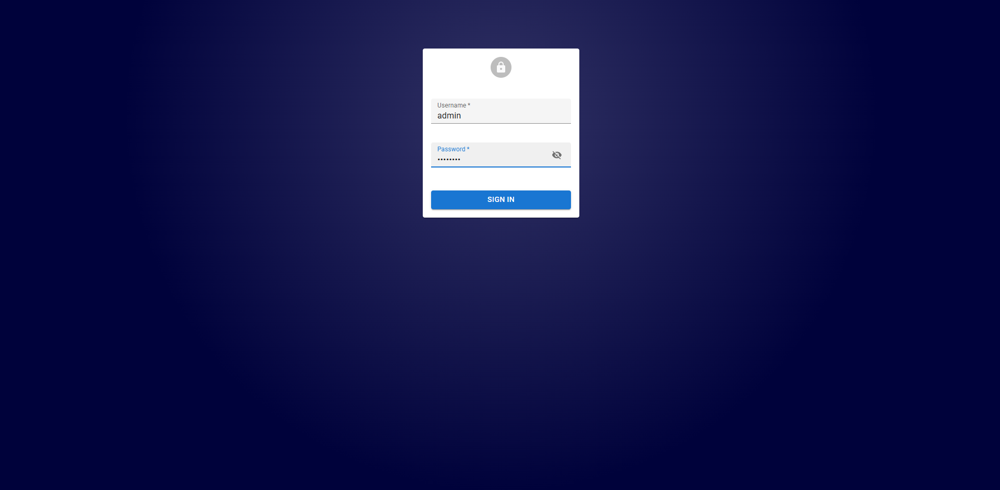
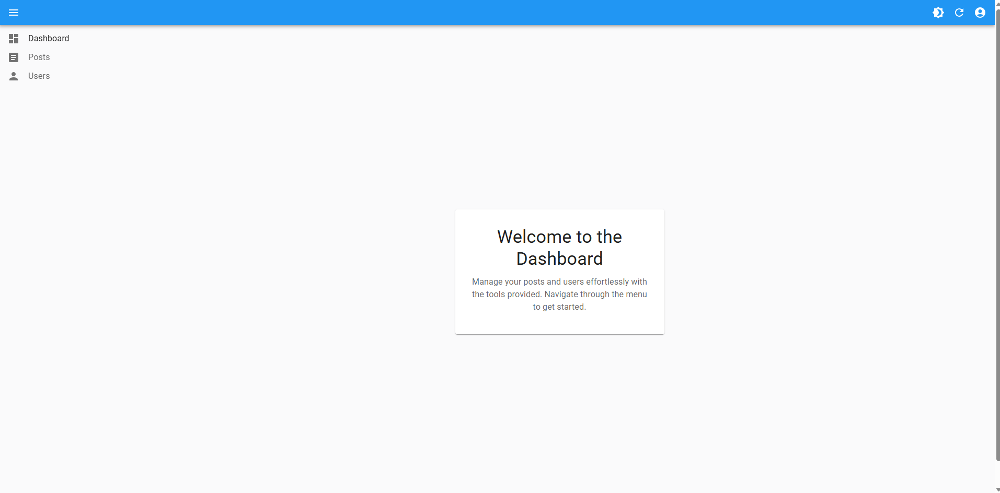
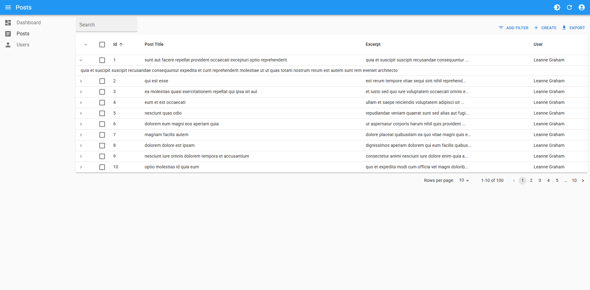
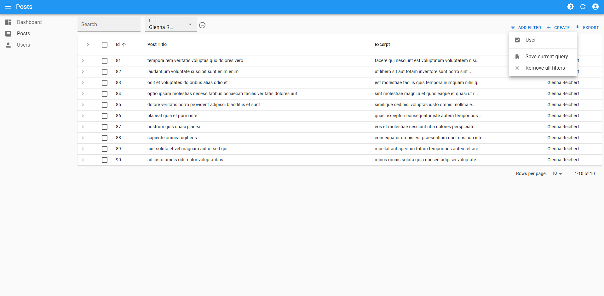
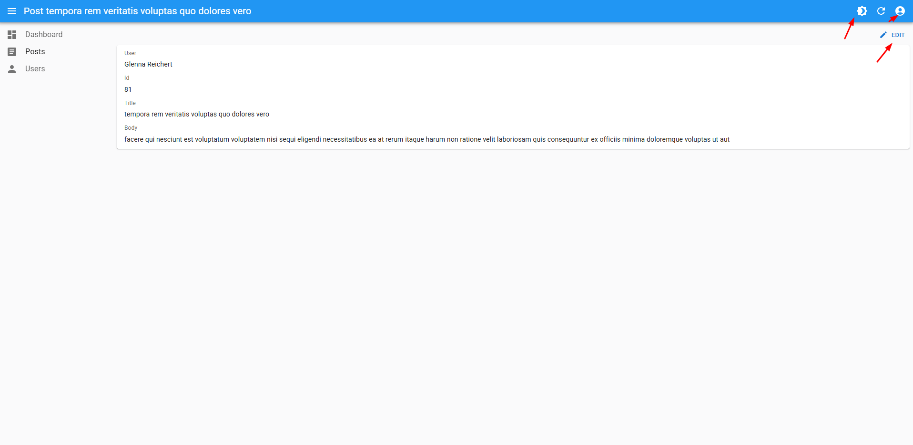
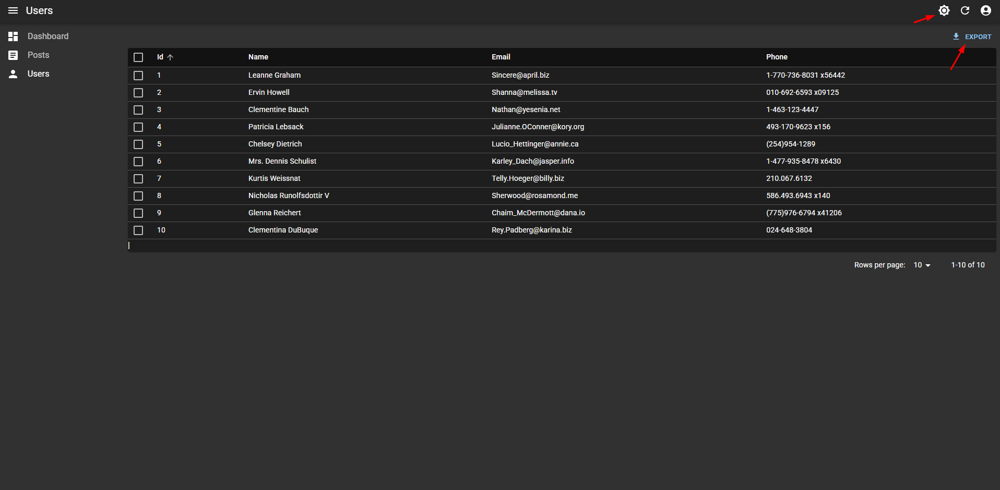

# react-admin-youssef

```








# React Admin Dashboard

Une application de gestion moderne construite avec React Admin, offrant une interface d'administration complète pour la gestion des posts et des utilisateurs.

## 🚀 Fonctionnalités

- **Authentification sécurisée** - Système de connexion avec AuthProvider
- **Gestion des Posts** - CRUD complet (Créer, Lire, Modifier, Supprimer)
- **Gestion des Utilisateurs** - Liste et visualisation des utilisateurs
- **Dashboard personnalisé** - Page d'accueil avec statistiques
- **Interface responsive** - Compatible mobile et desktop
- **Design Material-UI** - Interface moderne avec icônes

## 🛠️ Technologies utilisées

- **React Admin** - Framework d'administration
- **Material-UI** - Composants UI
- **TypeScript** - Typage statique
- **Prettier** - Formatage du code
- **ESLint** - Analyse du code

## 📁 Structure du projet

```
src/
├── pages/
│   ├── posts/
│   │   ├── post-list.js    # Liste des posts
│   │   ├── post-show.js    # Détail d'un post
│   │   ├── post-edit.js    # Édition d'un post
│   │   └── post-create.js  # Création d'un post
│   ├── users/
│   │   └── user-list.js    # Liste des utilisateurs
│   └── homepage.js         # Page d'accueil
├── Layout.js               # Layout personnalisé
├── dataProvider.js         # Fournisseur de données
├── authProvider.js         # Authentification
└── App.js                 # Composant principal
```

## 🚦 Installation

1. **Cloner le repository**
   ```bash
   git clone https://github.com/votre-username/react-admin-dashboard.git
   cd react-admin-dashboard
   ```

2. **Installer les dépendances**
   ```bash
   npm install
   ```

3. **Lancer l'application**
   ```bash
  npm run dev
   ```

4. **Accéder à l'application**
   ```
   http://localhost:3000
   ```

## 🔐 Authentification

**Identifiants par défaut :**
- Username: `admin`
- Password: `password`

## 📋 Fonctionnalités détaillées

### Posts
- ✅ Liste paginée des posts
- ✅ Création de nouveaux posts
- ✅ Modification des posts existants
- ✅ Affichage détaillé d'un post
- ✅ Suppression de posts

### Utilisateurs
- ✅ Liste des utilisateurs
- ✅ Référence aux posts par utilisateur

### Dashboard
- ✅ Page d'accueil personnalisée
- ✅ Navigation intuitive
- ✅ Messages de bienvenue

## ⚙️ Configuration

### Data Provider
Le data provider est configuré pour fonctionner avec une API REST standard. Modifiez `dataProvider.js` selon votre backend.

### Authentification
L'authentification utilise localStorage pour persister la session. Pour un environnement de production, implémentez une authentification JWT ou OAuth.

## 🎨 Personnalisation

### Thème
Modifiez le thème Material-UI dans le fichier `Layout.js` pour personnaliser l'apparence.

### Icônes
Les icônes utilisées :
- `ArticleIcon` pour les posts
- `PersonIcon` pour les utilisateurs

## 📝 Scripts disponibles

```bash
npm start          # Lance l'application en mode développement
npm run build      # Construit l'application pour la production
npm run lint       # Vérifie le code avec ESLint
npm run format     # Formate le code avec Prettier
```

## 🤝 Contribution

1. Fork le projet
2. Créez une branche (`git checkout -b feature/nouvelle-fonctionnalite`)
3. Committez vos changements (`git commit -m 'Ajoute nouvelle fonctionnalité'`)
4. Push vers la branche (`git push origin feature/nouvelle-fonctionnalite`)
5. Ouvrez une Pull Request

## 📄 Licence

Ce projet est sous licence MIT. Voir le fichier `LICENSE` pour plus de détails.

## 👨‍💻 Auteur

**Youssef Chehata**
- GitHub: [@votre-username](https://github.com/votre-username)
- Email: votre.email@example.com

## 🙏 Remerciements

- [React Admin](https://marmelab.com/react-admin/) pour le framework
- [Material-UI](https://mui.com/) pour les composants
- La communauté React pour les ressources et l'inspiration

---

⭐ N'hésitez pas à donner une étoile si ce projet vous a aidé !